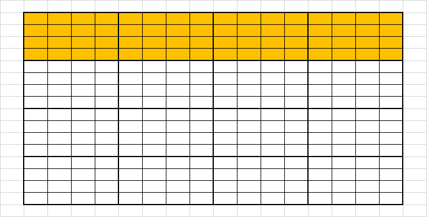
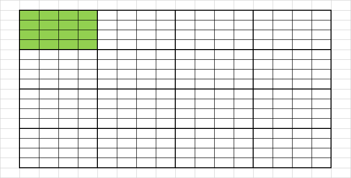
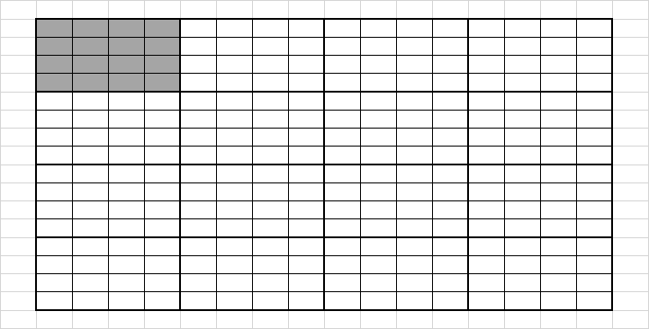

# Dependencias

## Fase 1
El bloque (k,k) solo depende de sí mismo.

## Fase 2
Cada bloque de la fila (k, -) depende del bloque (k,k)

## Fase 3
Cada bloque de la columna (-, k) depende del bloque (k,k)

## Fase 4
El resto de bloques (a,b) depende de los bloques (a,k) y (k,b)


# Paralelización actual
La fase 1 se ejecuta primero. Luego las fases 2 y 3 se ejecutan en paralelo, y por último la fase 4 se ejecuta luego de que terminen las fases 2 y 3.


# ¿Qué se puede mejorar? (Parte 1)
La fase 4 podría arrancar sin esperar a que las fases 2 y 3 se ejecuten por completo. Para respetar las dependencias se puede hacer uso de semáforos, habiendo
uno para cada bloque de tamaño BSxBS. Entonces, para computar cada bloque (a,b) de la fase 4 se espera a que los semáforos de (a,k) y (k,b) estén en 1.

## Entendiendo floydWarshall()
En base al archivo [block_sec](https://github.com/ulisescosti/Tesina-FW-XeonPhiKNL/blob/master/src/floyd_versions/block_sec.c), analizamos como se computa cada fase. La matriz es de tamaño "nxn", y los bloques son de tamaño "BSxBS", donde BS es submúltiplo de n. Tenemos las siguientes variables en común:

    n = r * BS, donde "r" es la cantidad de rondas. Ej: si n=16384 y BS=64, tenemos 256 rondas.
    
    row_of_blocks_disp = n * BS
    - n es la cantidad de celdas que hay en una fila completa.
    - BS es la cantidad de filas por bloque, igual a cantidad de filas completas por fila completa de bloques.
    - row_of_blocks_disp es la cantidad de celdas que hay en una fila completa de bloques.
    
    "k" es un iterador de rondas, que va de 0 a r-1.
    
En la siguiente imagen se observa qué representa gráficamente ```row_of_blocks_disp```:



Si luego multiplicamos ```row_of_blocks_disp``` por "k", obtenemos ```k_row_disp``` (las celdas que corresponden a la fila de la ronda actual):


Por otra parte, se define ```k_col_disp```, calculado como "k x BS x BS", que representa el bloque correspondiente a la columna "k":


    

### Fase 1
Se define una variable "kk", calculado como ```k_row_disp + k_col_disp```, que representa al bloque de ronda que solo depende de sí mismo:


