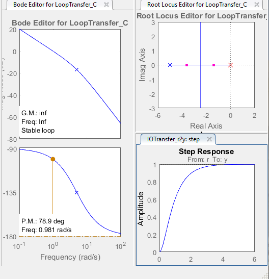
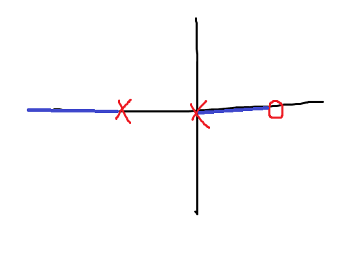
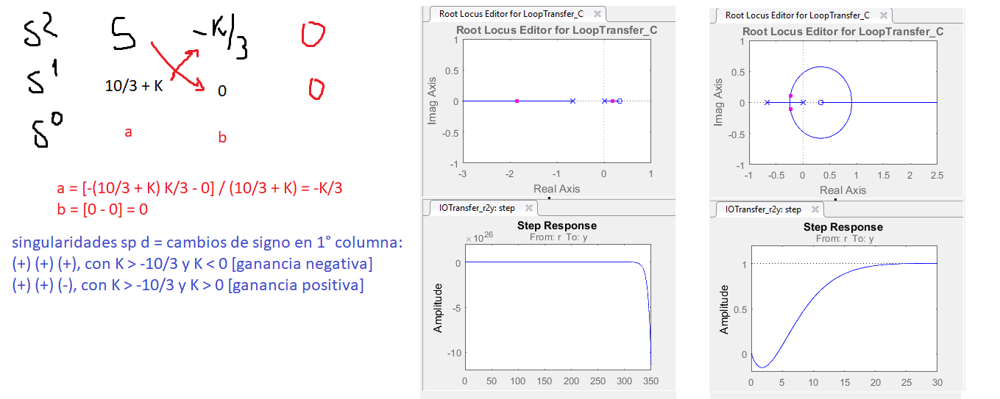

A no decaer!

## MatLab
```sisotool``` para entrar al Control System Bode Editor

### Sisotool
Se puede ver el diagrama de bloques mediante Edit Architecture.

Ejemplo (escribir en workspace): 
```
G = tf(1, [1 5]);
s = tf('s');
C = 5/s;          % integrador
```

Para cargarlo debo ingresar a Edit Architecture > Import



En el Root Locus Editor puedo modificar los polos simplemente arrastrándolos. Luego, mediante "Export", puedo obtener el nuevo valor de C en el workspace de MatLab.

Manos a la obra...

### Ejercicio 1d)

Cuando la tf tiene productos de (s+a) sirve para LDR, y cuando son (as+b) sirve para Bode.

```
G = K (3s - 1) / 10s (1,5s + 1) 
G = 3K (s - 1/3) / 15s (s + 2/3)
G = K (s - 1/3) / 5s (s + 2/3)
```

Polos en origen y s = -2/3, cero en 1/3, entonces n - m = 1



Calculando el ángulo de la asíntota: +-180° (es 1 sola)
* Entonces el cero del infinito está en menos infinito.

Calculando Routh... 
```
1 + CGH = 0
1 + G = 0
5s (s+2/3) + K (s - 1/3) = 0       % el denominador voló...
5 s^2 + (10/3 + K) s - K/3 = 0
```


