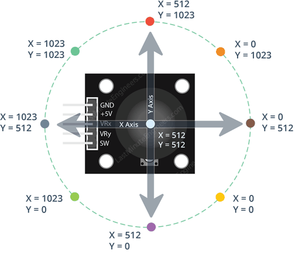
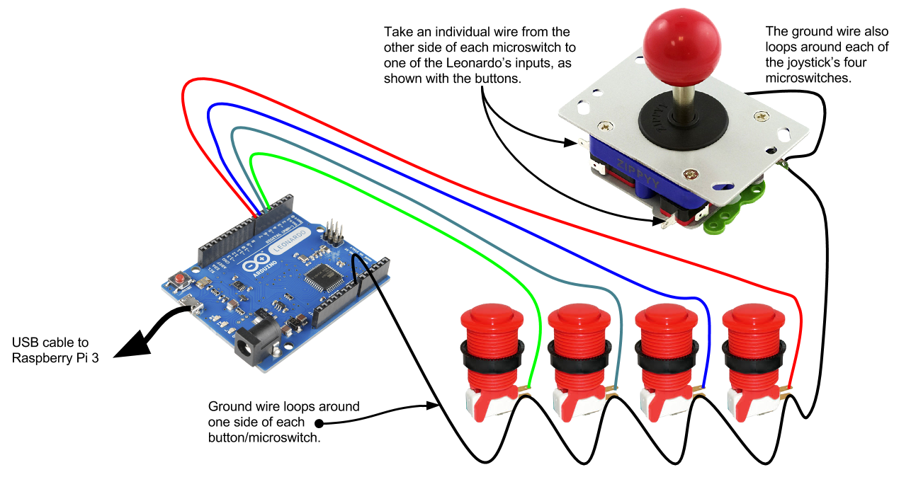

# Análisis previo al informe inicial
En adelante, joystick hará referencia a la palanca, y stick al conjunto de controles (palanca + pulsadores)

* Idea: https://www.kevinpeat.com/arduino_joystick.html

## Dimensiones
El arcade stick versión astro mide originalmente 240 x 350 mm, grosor 115 mm.

### Nuestra implementación
* Placa EDU-CIAA-NXP, de forma rectangular: 86 x 137 mm (14%)
* Módulo KY-023 DUAL AXIS JOYSTICK: 26 x 34 mm (1%, info: [link](https://arduinomodules.info/ky-023-joystick-dual-axis-module/))
* 6 x Botones genéricos de 30 mm de diámetro (6%)

### Implementaciones en Internet
* Arduino Pro Micro, de forma rectangular: 18 x 33 mm
* Módulo KY-023 DUAL AXIS JOYSTICK: 26 x 34 mm

### Complicaciones
En muchos ejemplos de Internet se muestra que la conexión simple a la computadora para manejar juegos con el "stick construido" es mediante un Arduino Leonardo. Nosotros estamos obligados a trabajar con EDU-CIAA (investigar como hacerlo).

* Doc (solo valido para basados en ATmega32u4 microcontroller): https://www.instructables.com/Add-USB-Game-Controller-to-Arduino-LeonardoMicro/

* "You can however get it to work with an Uno by sending your data via serial and using a processing sketch to receive it and send out keyboard commands, you can also look at pyserial and other alternatives."

* En este video ([link](https://www.youtube.com/watch?v=U6L8igSjaNw)) usan un programa en Python que utiliza la librería "keyboard" para simular que se presiona o suelta las teclas del teclado de la computadora.

## Elección de joystick

### Opción 1
Elegimos el modelo KY-023 porque permite movimientos en todas las direcciones posibles del plano XY, pudiendo leer la coordenada de la palanca mediante 2 señales <b>analógicas</b> (ya que provienen de potenciómetros ubicados debajo de la misma).

Las señales analógicas deberán conectarse a pines analógicos de la placa, de modo que mediante ADC se pueda leer dicho valor y codificarlo entre 0 y 1023.

Nos limitaremos a 8 direcciones posibles, así que se marcarán limites para la zona de reposo y los diferentes ángulos.

* Entrada de alimentación: rango entre 3.3V y 5V (Vcc)
* Salida a tierra (GND)
* 2 salidas analógicas de la posición de X e Y (VRx y VRy)
* 1 salida digital de joystick presionado (SW).

Precio de Mercado Libre: $580

### Opción 2
El modelo más fiel al stick es la palanca Sunwayt 5103 de 8 direcciones, que posee 4 salidas digitales para identificar las mismas. Si por ejemplo la dirección es "Diagonal hacia arriba e izquierda", estarán activadas las señales de UP y LEFT.

* Utiliza 4 microswitches para las señales. ¿Opera con 12V?
* Dimensiones: 95 x 60 x 30 mm
* Video: https://www.youtube.com/watch?v=zJBl94WdWvg

Precio de Mercado Libre: 2 x $3800

## Elección de botones
Se colocarán 6 botones organizados en 2 filas de 3.

- De 6 mm (4 patas): 10 x $270
- De 30 mm (3 terminales): 2 x $930 / 5 x $2000