# Forwarding: si y no

## Programa 1: LOAD + ALU
- Activado: de salida MEM a entrada EX
- Desactivado: de WB a ID (por registro)

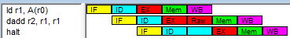
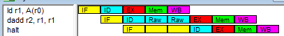

## Programa 2: LOAD R1 + STORE R1
- Activado: de salida MEM a entrada MEM
- Desactivado: de WB a ID (por registro)

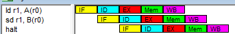
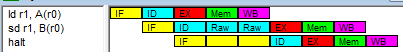

## Programa 3: LOAD R1 + STORE 0(R1)
- Activado: de salida MEM a entrada EX
- Desactivado: de WB a ID (por registro)

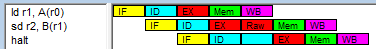
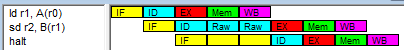

## Programa 4: ALU R1 + LOAD 0(R1)
- Activado: de salida EX a entrada EX
- Desactivado: de WB a ID (por registro)

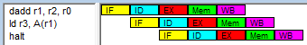
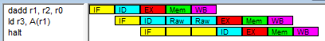

## Programa 5: ALU R1 + BEQ R1
- Activado: de salida EX a entrada ID
- Desactivado: de WB a ID (por registro)

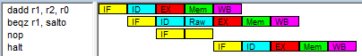
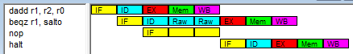

## Programa 6: LOAD R1 + BEQ R1
- Activado: de salida MEM a entrada ID
- Desactivado: de WB a ID (por registro)

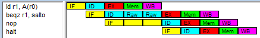
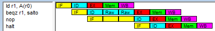

Este es el único caso donde no hay mejora.