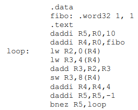
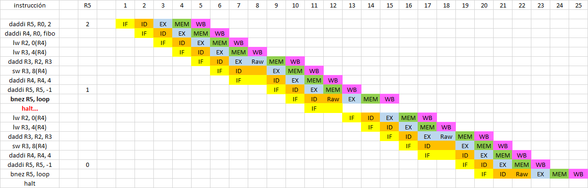
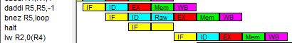
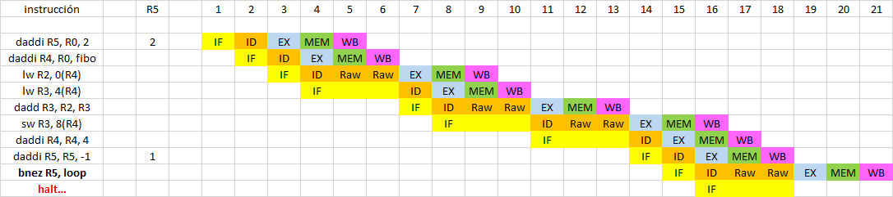

# Forwarding: sí y no.

Dependencias RAW:
- LW R2: lee operando R4
- LW R3: lee operando R4
- DADD R3: lee operandos R2 y R3
- SW R3: lee operando R3
- BNEZ R5: lee operando R5

## Con Forwarding
- LW R2: de salida EX a entrada EX (0 stalls)
- LW R3: de salida EX a entrada EX (0 stalls)
- DADD R3: de salidas MEM a entrada EX (1 stall)
- SW R3: de salida EX a entrada MEM (0 stalls)
- BNEZ R5: de saldia EX a entrada ID (1 stall)

Resolución manual: 2 stalls por iteración, entonces si R5 = 10, tendremos 20 stalls. Además, la resolución de los saltos provoca también un Stall si salta, resultan 20+9 = 29 stalls.

Son 2 instrucciones iniciales más 7 instrucciones por iteración + halt, resultan 73 instrucciones.

- Ciclos = n + k - 1 + Stalls = 73 + 4 + 29 = 106
- CPI = 106 ciclos / 73 instrucciones = 1.45

## Sin Forwarding
En todos los casos de dependencia se espera a la etapa WB para resolver ID. En la primera iteración se tienen 8 stalls por RAW, en las restantes son 6 stalls por RAW. Respecto a los saltos, nuevamente son 9 stalls por salto tomado.

- Resultan entonces 8 + 6 x 9 + 9 = 71 stalls
- Ciclos = 73 + 5 - 1 + 71 = 77 + 71 = 148
- CPI = 148 ciclos / 73 instrucciones = 2.02 ✔️