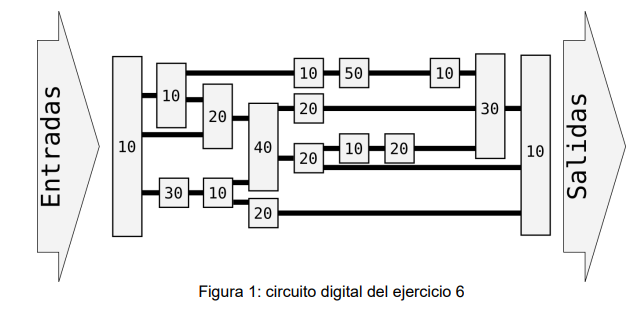

# Datapath

- Latencia máxima mono: 

    T = 10+10+20+40+20+10+20+30+10 = 170 ns

- Frecuencia máxima mono: 5.88 MHz

- Con 4 etapas, lo mejor es que cada una tenga una latencia de 42,5 ns, de modo que sea balanceado. Sin embargo, existe un bloque lógico con latencia 50 ns, por lo que resulta imposible.

- Frecuencia máxima de 4 etapas: 20 MHz