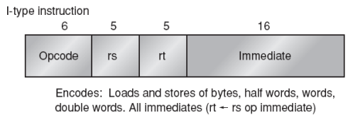
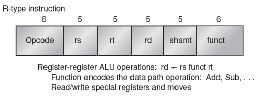
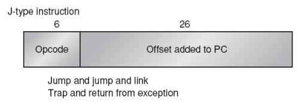

## Formatos de instrucción MIPS
Todas son de ancho 32 bits. Los campos de registros son de 5 bits porque se dispone de 32 registros.

Tipo I (inmediato): incluye a Load, Store

- Opcode: código de operación de 6 bits.
- RS: registro fuente de 5 bits.
- RT: registro destino de 5 bits.
- Immediate: dirección o número de 16 bits.

Tipo R: operaciones registro a registro (ALU, saltos condicionales).

- RS, RT y RD: registros operandos y destino.
- Funct: función a aplicar con RS y RT (6 bits).

Tipo J: salto con desplazamiento.

- Offset: valor de 26 bits sumado al PC.

