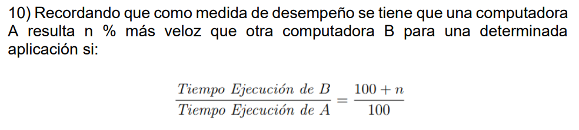

- Procesador 1:
    - Intel (CISC) de f = 400 MHz
    - Hasta 4 instrucciones por ciclo
    - Pipeline de 12 etapas
    - CPI = 1.6

- Procesador 2:
    - Alpha (RISC) de T = 1,5 ns (667 MHz)
    - Pipeline de 9 etapas
    - CPI = 0.8
    - Requiere 40% más de instrucciones

## Latencia minima de instrucción
- Procesador 1: 2,5 ns
- Procesador 2: 1,5 ns

## Tiempo promedio de instrucción
- Procesador 1: 1.6 x 2,5 ns = 4 ns
- Procesador 2: 0.8 x 1,5 ns = 1,2 ns

## ¿Cuál es más rápido?
- Procesador 1: 100 x 4 ns = 400 ns
- Procesador 2: 140 x 1,2 ns = 168 ns

Speedup de B = 400 ns / 168 ns = 2,38
Speedup de B = (100+n) / 100 = 2,38

Entonces B es 138% más rápido que A.