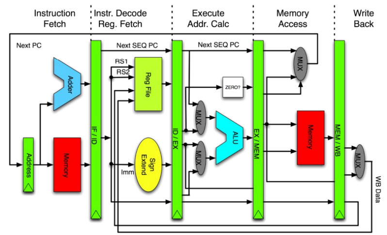

# Segmentación RISC
Clásica de 5 etapas: IF, ID, EX, MEM, WB

- IF: capta la próxima instrucción a ejecutar desde memoria de instrucciones e incrementa PC.

- ID: decodifica la instrucción y lee los operandos de los registros indicados. En esta etapa finalizan los saltos.

- EX: depende el tipo de instrucción.
    - Load/Store: calcula dirección efectiva.
    - ALU R-R: aplica función a operandos.
    - ALU R-I: aplica función usando operando del registro RS y el valor inmediato de 16 bits.

* MEM: accede a memoria de datos.

* WB: escribe en el registro de salida.

## Caso Load
- IF: se capta instrucción.
- ID: decodifica que es Load y cuál es RT.
- EX: calcula dirección de memoria
- MEM: accede al dato en memoria.
- WB: escribe el dato en el registro RT.

## Caso Store
- IF: se capta instrucción.
- ID: decodifica que es Store y cuál es RS.
- EX: calcula dirección de memoria
- MEM: escribe el dato en memoria.

## Caso ALU
- IF: se capta instrucción.
- ID: decodifica que es ALU, lee operandos.
- EX: aplica función a operandos.
- MEM: no se ejecuta.
- WB: escribe el resultado en registro RD.

## Caso Salto
- IF: se capta instrucción.
- ID: decodifica que es salto y evalúa la condición.
