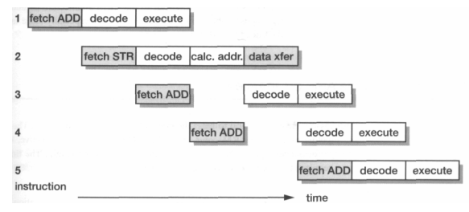
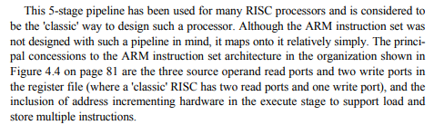

## Pipeline ARM de 3 etapas
Utiliza arquitectura de memoria no separada entre datos e instrucciones.

- Fetch: capta instrucción desde memoria.
- Decode: decodifica lógica de instrucción.
- Execute: lee operandos del banco de registros, realiza la operación y escribe el resultado en el registro destino.

Una sola instrucción puede estar en la etapa Decode a la vez. Lo mismo aplica para Execute.

Los datos siempre se leen y escriben en la etapa Execute, y como la emisión y finalización es ordenada no existen riesgos RAW.

## Pipeline ARM de 5 etapas
Separa la memoria de datos e instrucciones, para evitar el cuello de botella (ver pág. 90). Además, se agrega Forwarding (pág. 91)

- Fetch: capta instrucción desde memoria.
- Decode: decodifica la instrucción y lee los operandos del banco de registros (hasta 3)
- Execute: se resuelve la operación ALU. En caso de Load/Store se calcula dirección efectiva.
- Buffer/data: se accede a memoria de datos si se requiere, sino se guarda el resultado de la ALU en un buffer.
- Writeback: se escribe en registro.

Posibilidades en simultáneo:
- ARM: lectura de 3 operandos y escritura de hasta 2 registros.
- RISC: lectura de 2 operandos y escritura de 1 registro.

También ARM incluye un HW sumador en la etapa EX para soportar múltiples Load y Store.
