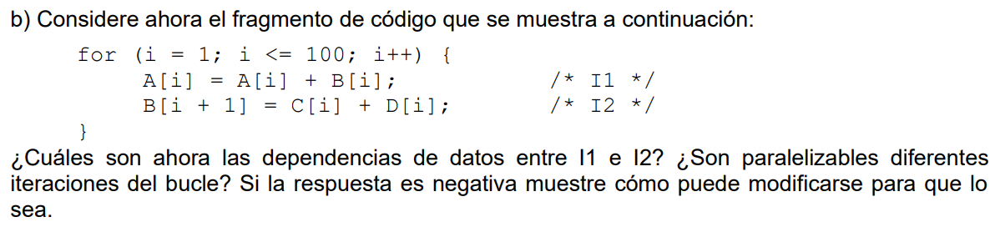

- Dependencias dentro de la iteración:
    - Ninguna, ya que I2 no utiliza A[i]

- Dependencias entre iteraciones_
    - I1 lee A[i] y escribe sobre el mismo operando A[i], por lo que I1 es paralelizable respecto a sí mismo.

    - I2 lee C[i] y D[i] para luego escribir en el operando B[i+1]. Como B[i] no es leído, I2 es paralelizable respecto a sí mismo.

    - I1 lee B[i] e I2 escribe B[i+1]
        - Ejemplo: para i=1, I1 lee B[1] e I2 escribe en B[2], pero luego para i=2, I1 lee B[2] e I2 escribe B[3], entonces <b>SÍ existe dependencia verdadera entre iteraciones consecutivas</b>.

Por lo tanto, las iteraciones NO son paralelizables.

## Solución
Caso actual:

    A[1] = A[1] + B[1]
    B[2] = C[1] + D[1]  <-- Acá se escribe B[2]
    A[2] = A[2] + B[2]  <-- Acá se lee B[2]
    B[3] = C[2] + D[2]

Caso mejorado: como I1 e I2 son instrucciones independientes entre sí dentro de una iteración, se las puede reordenar sin afectar el resultado. No se elimina la dependencia RAW ya que es inevitable, pero se da una mayor separación entre las instrucciones en conflicto.

    B[2] = C[1] + D[1]  <-- Acá se escribe B[2]
    A[1] = A[1] + B[1]
    B[3] = C[2] + D[2]
    A[2] = A[2] + B[2]  <-- Acá se lee B[2]

