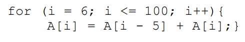
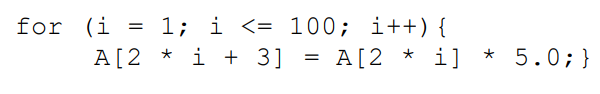

Evaluar el grado de paralelismo

    A[6] = A[1] + A[6]  <-- Acá escribo A[6]
    A[7] = A[2] + A[7]
    A[8] = A[3] + A[8]
    A[9] = A[4] + A[9]
    A[10] = A[5] + A[10]
    A[11] = A[6] + A[11]    <-- Acá leo A[6]

Podemos observar que la instrucción depende de un operando resuelto 5 iteraciones atrás. Esto permite ejecutar hasta 5 iteraciones consecutivas en paralelo ya que son independientes entre sí (en el ejemplo sería de i=6 a i=10).

    A[5] = A[2] * 5
    A[7] = A[4] * 5
    A[9] = A[6] * 5
    A[11] = A[8] * 5

En este caso, el grado de paralelización es prácticamente infinito, ya que el operando leído siempre refiere a un índice PAR, mientras que el operando escrito refiere siempre a uno IMPAR.
