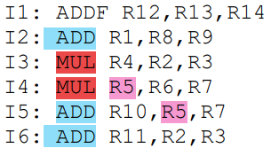

* Puede captar, decodificar y emitir dos instrucciones simultáneamente en un ciclo de reloj.

* Puede finalizar (commit) dos instrucciones simultáneamente.

* Dispone de las siguientes UF:
    * Un sumador PF (2 ciclos)
    * Un sumador entero (1 ciclo)
    * Un multiplicador entero (1 ciclo)

## Emisión y finalización ordenada
Los resultados temporales se almacenan en un ROB.

    Issue       ADDF    ADD     MUL     Commit
    I1, I2
    I3, I4      I1      I2
    I5, I4      I1              I3
    I5, I6              -       I4      I1, I2
        I6              I5              I3, I4
                        I6              I5
                                        I6

La ejecución toma 7 ciclos.
