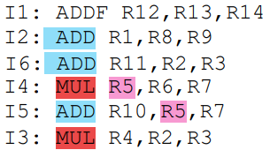

## Emisión y finalización ordenada
Los resultados temporales se almacenan en un ROB.

    C   Decode      ADDF    ADD     MUL     Commit
    1   I1, I2
    2   I6, I4      I1      I2
    3   I6, I4      I1      
    4   I5, I3              I6      I4      I1, I2
    5                       I5      I3      I6, I4
    6                                       I5, I3

Con el reordenamiento, ahora toma 6 ciclos. Las UF se utilizan un 58% del tiempo (ciclos 2-5).