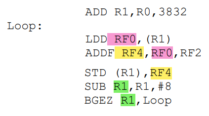

* Arquitectura de carga-almacenamiento
* Dispone de 5 UF, puede emitir en simultáneo:
    - 2 referencias a memoria
    - 2 operaciones de PF
    - 1 operación entera o 1 salto
* Operaciones con enteros: 1 ciclo
* Carga de un double: 2 ciclos
* Operaciones en PF: 3 ciclos (segmentado)

Dentro de la iteración se tienen instrucciones con dependencia verdadera entre sí. La carga llevaría 2 ciclos, la suma 3 ciclos, el store 1 ciclo?, la resta 1 ciclo y el salto 1 ciclo?

- I1 = LDD + SUB (2 ciclos)
- I2 = ADDF + BGEZ (3 ciclos)
- I3 = STD (1 ciclo)

Una iteración se resuelve en 6 ciclos