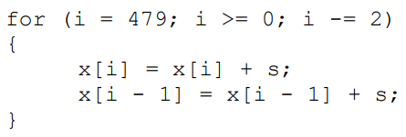

            ADD R1, R0, 3832
    
    Loop:   LDD RF0, (R1)           ;; cargo x[i]
            ADDF RF4, RF0, RF2      ;; sumo s
            STD (R1), RF4           ;; guardo x[i]

            SUB R1, R1, 8           ;; i--
            LDD RF1, (R1)
            ADDF RF5, RF1, RF2      ;; sumo s
            STD (R1), RF5

            SUB R1, R1, 8           ;; i--
            BGEZ R1, Loop

Para VLIW:
- I1 de 2 ciclos: LDD RF0, SUB R1b
- I2 de 3 ciclos: LDD RF1, ADDF RF4, SUB R1c
- I3 de 3 ciclos: STD R1a, ADDF RF5, BGEZ R1c
- I4 de 1 ciclo: STD R1b

Se completan 2 iteraciones en 9 ciclos. Antes era una sola iteración en 6 ciclos (speedup 1.33)