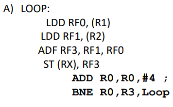

Con 1 iteración: todas op tardan 1 ciclo

    C   MEM     MEM     PF      PF      INT
    1   LDD     LDD
    2                   ADDF            ADD 4
    3   STD                             BNE

Con 2 iteraciones:

    C   MEM     MEM     PF      PF      INT
    1   LDD0    LDD1
    2   LDD4    LDD5    ADDF3
    3   STD3            ADDF6           ADD 8
    4   STD6                            BNE

Con 3 iteraciones:

    C   MEM     MEM     PF      PF      INT
    1   LDD0    LDD1
    2   LDD4    LDD5    ADDF3
    3   LDD7    LDD8    ADDF6      
    4   STD3    STD6    ADDF9           ADD 12
    5   STD9                            BNE

Vemos que siempre queda una PF sin usar