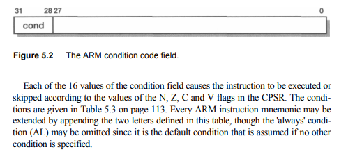

En MIPS:

            BEQZ    R1, Else
            ADD     R2, R3, 0
    Else:   ...

En ARM:
- Fuente: [conditional](http://www.davespace.co.uk/arm/introduction-to-arm/conditional.html)

        CMP     R1, #0
        ADDEQ   R2, R3, R0
        ...

En MIPS:

            BLEZ    R1, Else
            ADD     R1, R3, R0
            J       Cont
    Else:   SUB     R1, R0, R3     
    Cont:   ...

En ARM:

            CMP     R1, #0
            ADDGT   R1, R3, R0
            SUBLEQ  R1, R0, R3
            ...

Itanium ejecuta las instrucciones de ambas bifurcaciones aunque no se conozca el resultado (predicado = 0), pero no se efectiviza el commit hasta conocerse dicha condición.

La ejecución condicional de ARM hace que cada instrucción se ejecute o no según los flags del CPSR (current program status register)