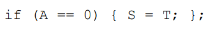
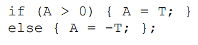

En MIPS:

            BEQZ    R1, Else
            ADD     R2, R3, 0
    Else:   ...

En ARM:
- Fuente: [conditional](http://www.davespace.co.uk/arm/introduction-to-arm/conditional.html)

        CMP     R1, #0
        ADDEQ   R2, R3, R0
        ...

En MIPS:

            BLEZ    R1, Else
            ADD     R1, R3, R0
            J       Cont
    Else:   SUB     R1, R0, R3     
    Cont:   ...

En ARM:

            CMP     R1, #0
            ADDGT   R1, R3, R0
            SUBLEQ  R1, R0, R3
            ...