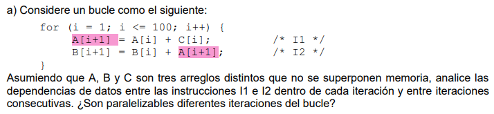

# Superescalares y VLIW
Capítulo 3: explotación del ILP bajo planificación dinámica y estática.

## Ej 1

- Dependencias dentro de la iteración:
    - Dependencia verdadera (RAW) entre I2 e I1 por el operando A[i+1].

- Dependencias entre iteraciones consecutivas:
    - Dependencia verdadera (RAW) en I1, por el operando A[i], que se resuelve en la iteración anterior debido al A[i+1].
        - Ejemplo: en la iteración i=1, I1 lee el operando A[1] y escribe A[2], luego para i=2 se lee A[2] y escribe A[3]...

    - RAW similar en I2 con B[i] y B[i+1].

Podemos concluir que no es posible paralelizar diferentes iteraciones del bucle debido a las dos instrucciones de cada iteración requiere los operandos resueltos en la iteración anterior.