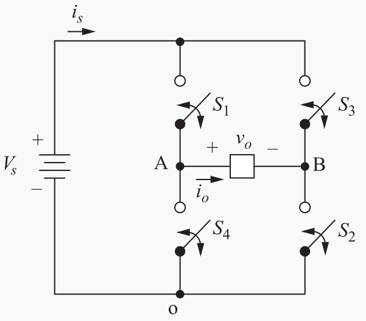

# Módulo 2 - Inversores

## Tarea 4: Onda Cuadrada y PWM Monopulso (con a = 30°)
En ambos casos se utiliza el mismo circuito, cambiando la conmutación de llaves. Se piden 4 gráficas (8 en total), cuyo eje temporal esté 
expresado en wt, desde 0 hasta 4 pi, es decir, dos ciclos completos.

1) Señales de las llaves, usando 2 colores (uno para S1 y \S4, y otro para S2 y \S3)
2) Tensión de la llave S4 (VAo).
3) Tensión de la llave S3 (VBo).
4) Tensión en la carga (Vo)

Luego, para la tensión fundamental calcular la tensión pico (V1) y su valor eficaz (V1,rms). Dato: Vs = 300V

