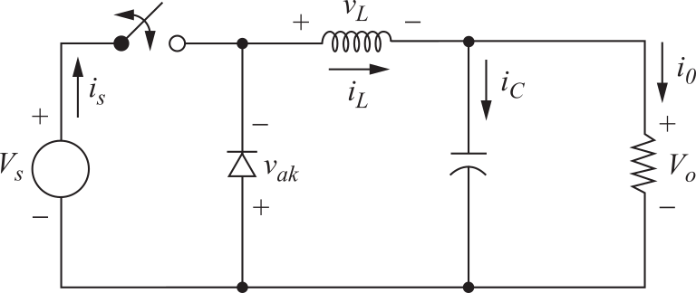

## Electrónica II

## Tarea 1 - Rectificación

## Tarea 2 - Conversión CC/CC
Hacer esto para el reductor y el elevador (separados), ambos con D = tON / Ts = 0.25.

* Gráfico 1: señal de conmutación de las llaves para t = 0..2 Ts
* Gráfico 2: tensión y corriente en inductor (vL e iL)
* Gráfico 3: corriente de la fuente (iS) y tensión del diodo (vAK)
* Calcular tensión en la carga (Vo) y potencia en la fuente (Ps). Datos: R = 5 Ohm, Vs = 20V.

Nota: aclarar en los 3 gráficos los tiempos tON, Ts, Ts + tON y 2 Ts.

