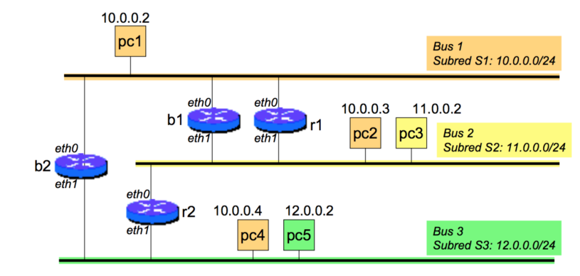

## Tablas de ruteo

### ¿Qué se debe hacer para conectar pc1 y pc3?
- Primero chequeamos si pertenecen a la misma red:
    - PC1 es de la subred 10.0.0.0/24.
    - PC3 es de la subred 11.0.0.0/24.

Resulta que no son, así que indefectiblemente deberá atravesar un router, en este caso, el camino mínimo es a través de r1.

- Si la tabla de ruteo de r1 está vacía:
    - Asigno dirección IP a la interfaz eth0 de r1: 10.0.0.1
    - Asigno dirección IP a eth1 de r1: 11.0.0.1

De esta forma cuando llega un paquete con dirección destino 10.0.0.x u 11.0.0.x al router irá a la red correspondiente.

- Si la tabla de ruteo de PC1 está vacía:
    - Se debe proveer una ruta para la subred 11.0.0.0/24, que será 10.0.0.1 (eth0 de r1)

Ahora todos los paquetes que deba enviar PC1 a la subred S2 irán a la interfaz eth0 de r1. Hay que hacer algo similar para el otro host:

- Si la tabla de ruteo de PC3 está vacía:
    - Se debe proveer una ruta para la subred 10.0.0.0/24, que será 11.0.0.1 (eth1 de r1)