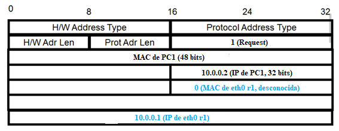
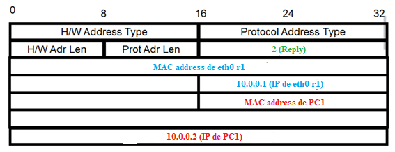

## Tablas de ruteo

### Mensajes durante ping PC1 a PC3
Según lo definido en el punto anterior, la ruta a la red 11.0.0.0/24 desde PC1 es a través de la interfaz eth0 de r1 (dirección 10.0.0.1)

- Si la tabla ARP de PC1 está vacía, no conozco la dirección MAC de 10.0.0.1, necesaria para la transmisión.
    - PC1 envía un ARP Request, que es un broadcast en su red 10.0.0.0/24, preguntando por la dirección MAC de quien tenga la dirección IP 10.0.0.1
    - r1 responde con ARP Reply, ya no como broadcast porque conoce la IP destino (PC1), contenida en el ARP Request recibido. Entonces hay un ARP Reply de eth0 r1 a PC1.

- Una vez conocida la MAC address de 10.0.0.1, PC1 envía el ICMP de Echo Request a éste.

- Como la tabla ARP de r1 no contiene la MAC address de PC3:
    - La interfaz eth1 de r1 envía ARP Request preguntando por MAC de IP 11.0.0.2

    - PC3 envía ARP Reply a la IP 11.0.0.1.

- 11.0.0.1 envía el Echo Request de PC1 a PC3.
- PC3 envía Echo Reply a la ruta a PC1 (11.0.0.1)

- 10.0.0.1 envia el ICMP de Echo Reply a PC1.

Podemos concluir que en Bus 1 se ve:
- ARP Request de PC1.
- ARP Reply de r1 (desde interfaz eth0)
- Echo Request de PC1.
- Echo Reply de eth0 r1, originalmente de PC3.

...y en el Bus 2 se ve:
- ARP Request de r1 (desde interfaz eth1)
- ARP Reply de PC3.
- Echo Request de eth1 r1, originalmente de PC1.
- Echo Reply de PC3.

... y en el Bus 3 no hay nada porque no se configuró el switch que conecta S1 y S3.