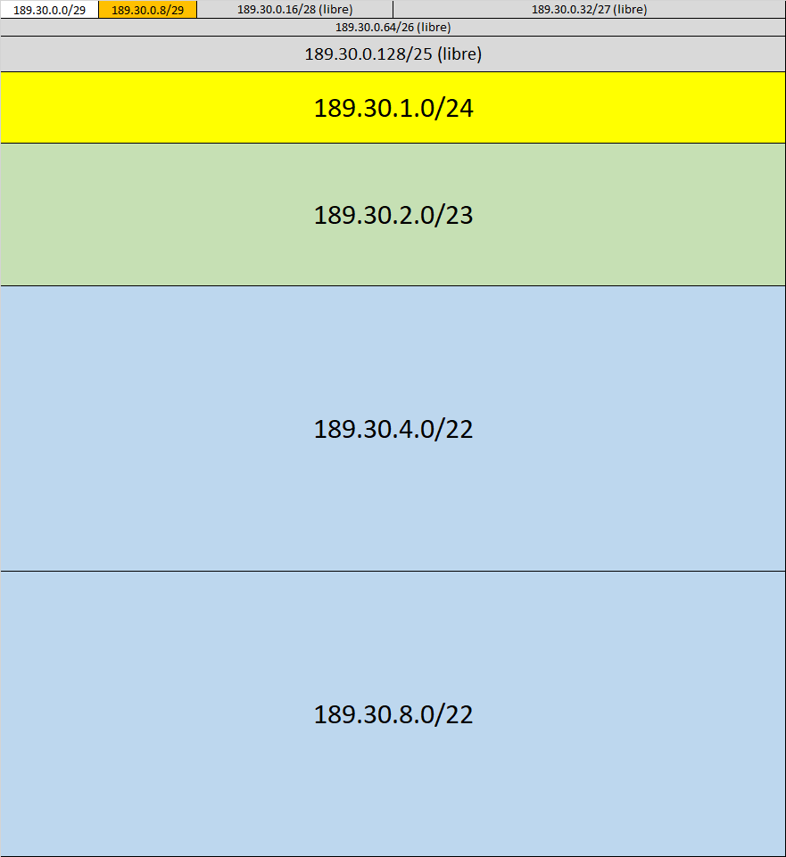

## Subnetting
Tenemos una red 189.30.0.0/16. Sin usar subred 0, asignar:

- LAN 1 de 300 hosts: 189.30.2.0/23

- LAN 2 de 800 hosts: 189.30.4.0/22

- LAN 3 de 800 hosts: 189.30.8.0/22

- LAN 4 de 150 hosts: 189.30.1.0/24

- Red Frame Relay (malla): 189.30.0.8/29

### Solución
Se recomienda empezar por la que tiene más hosts. Para 800 hosts necesito log(1024) = 10 bits, entonces la máscara debe ser /22.

    Subred 189.30.X.0/22
    donde X = XXXX XX00     <-- resolución 4

Elegimos 189.30.4.0/22 para LAN 2 y 189.30.8.0/22 para LAN 3, ya que 189.30.0.0/22 está reservada, pero se puede subnetear.

Luego, para 300 hosts necesito log(512) = 9 bits.

    Subred 189.30.X.0/23
    donde X = XXXX XXX0     <-- resolución 2

Podría asignar la red 189.30.12.0/23 para LAN 1, pero resulta conveniente tomar 189.30.2.0/23, ya que la subred 0 no se usa.

Para 150 hosts, necesito log(256) = 8 bits, máscara /24.

    Subred 189.30.X.0/24
    donde X = XXXX XXXX     <-- resolución 1

Siguiendo el procedimiento anterior, elegimos 189.30.1.0/24 como subred de LAN 4, pudiendo subnetear 189.30.0.0/24.

Por último, para las redes interconectadas necesito 4 direcciones, ya que FR es como un switch desde IP. Se asigna una subred con 3 bits en la parte de nodos (8-2 >= 4), es decir, máscara /29.

    Subred 189.30.0.X/29
    donde X = XXXX X000     <-- resolución 8

Elegimos entonces 189.30.0.8/29 para interconexión.

Así resultó la distribución entre 189.30.0.0 y 189.30.0.11.255:

