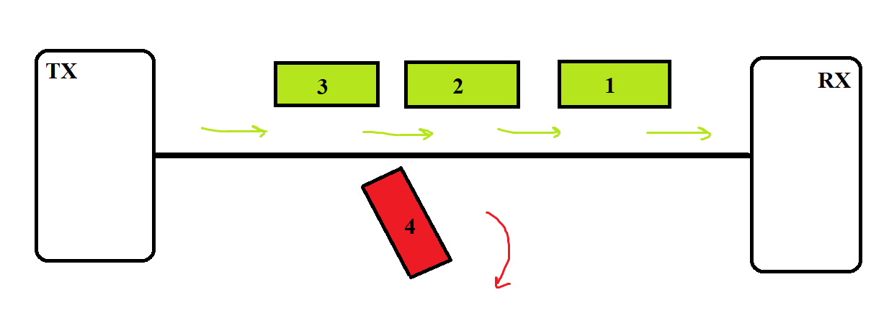

## Pérdida de fragmentos

Si llegan correctamente los 3 primeros fragmentos y el último se retrasa bastante, sucederá que el temporizador de RX expirará y vaciará su buffer de recepción, perdiéndose los 3 fragmentos que habían llegado.

Luego, al llegar el fragmento 4 a RX, se almacena en el buffer de recepción esperando a que lleguen los 3 que le anteceden para reordenarlos, como si de un nuevo datagrama se tratara.