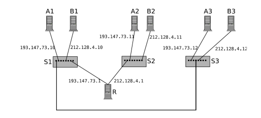
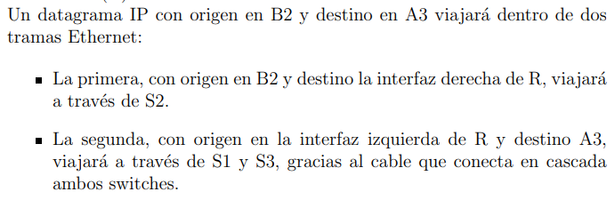

- ¿Puede B2 enviar datagramas IP a A3?

Analicemos a qué redes pertenecen:
- B2: red 212.128.4.0 (llamemos Red B)
- A3: red 193.147.73.0 (llamemos Red A)

Son de distintas redes -> pasar por router R.

- Camino: B2 > S2 > R > S1 > S3 > A3.

La tabla de ruteo de B2 solo contiene default gateway (0.0.0.0) a pasar por 212.148.4.1, así que lo mandará a esa interfaz de R. ✔️ <b>Aclaración: B2 consulta la tabla de ruteo solamente porque sabe que A3 es de otra subred.</b>

Luego, la dirección destino es de Red A, entonces R lo encaminará por 192.147.73.1, llegando a A3.

<b>No confundir: el datagrama IP siempre tiene la dirección IP origen y destino final, nunca las de nodos intermedios </b>. En cambio las tramas Ethernet contienen direcciones MAC de origen y final de UNA MISMA RED.

- ¿Puede B3 enviar datagramas IP a A1?

Nuevamente, el destino está en otra subred, entonces B3 consulta su tabla de ruteo. Solo encuentra default gateway por 212.128.4.1. Sin embargo, esa interfaz no es accesible a través de S1 y S3, está del lado derecho del router. <b>Aclaración: de hecho, no es accesible porque falla el protocolo ARP para obtener la MAC.</b>

- Solución 1A: conectar los switches S2 y S3 entre sí. ✔️
- Solución 1B: conectar switches S1 y S2 entre sí.

- Solución 2A: cambiar next hop del default gw de B3 para que sea 193.147.73.1, que es alcanzable? NO, es otra red. ❌
- Solución 2B: agregar una segunda IP a la interfaz izquierda de R (IP Aliasing) que sea de la misma subred que B3, como 212.128.4.2. Luego, cambiar default gw de B3 por ésta.