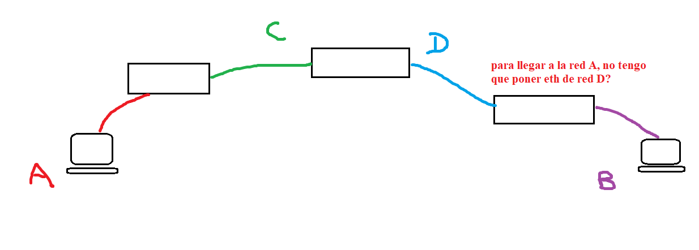

# Verdadero o Falso

- A partir de la dirección broadcast de una red puedo deducir su máscara.

    - Mi respuesta: Sí, porque de hecho la máscara se aplica sobre una dirección IP para obtener la subred a la que pertenece. Para ello, la parte de hosts está todo reemplazada por ceros (si se aplica AND)....

    - Corrección: NO, es falso. Se debe recordar que una dirección particular puede ser asociada con diferentes máscaras según la subred. 

Recomendación: ante la duda, buscar contraejemplo:

    192.168.127.255... ¿quién es la máscara? xd
    la subred podría ser 192.168.0.0/17
    aunque también 192.168.64.0/18
    o incluso 192.168.96.0/19, y así.

- En una tabla de ruteo, el gateway para llegar a una red determinada debe tener una IP dentro del rango de dicha red.

    - Mi respuesta: Falso, la afirmación es cierta en el caso de los hosts, donde la IP del próximo salto es una interfaz de router con dirección IP de la misma red. Sin embargo, el router interconecta redes, por lo que es fundamental que pueda ser de otra red.

    - Corrección: NO, dice que es verdadero, pero creo que lo siguiente lo contradice...

 

 - La dirección de red 135.28.118.0 puede corresponder a una subred de la 135.28.116.0.

    - Mi respuesta: Sí, 116 = 64 + 32 + 16 + 4, entonces es el binario 0111 0000, y 118 = 116 + 2 = 0111 0010. Posibles: 135.28.116.0/21 y 135.28.118.0/22.