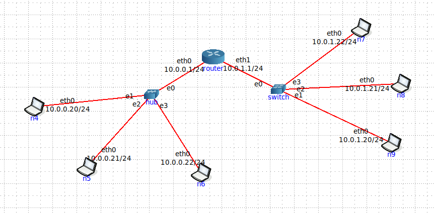
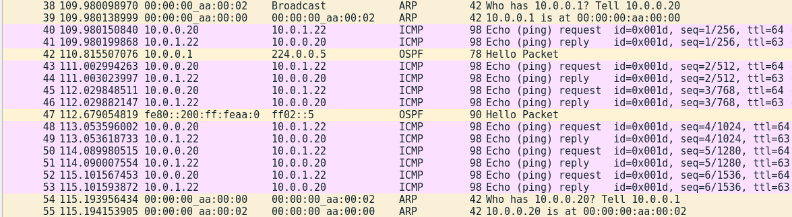
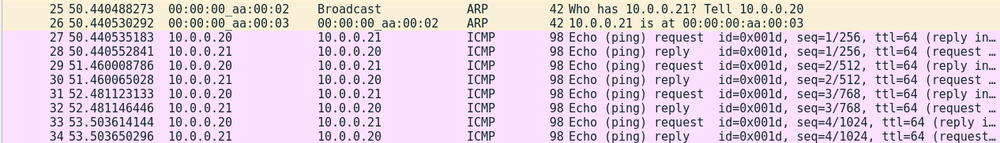

# Ej 21


## Inciso 1
Si una PC se desea conectar a otra PC en una red distinta, ¿es necesario ejecutar ARP? ¿A quién le envió el ARP Request?

Suposición: la PC origen no conoce la MAC destino, entonces yo creería que sí.

Verificación: Wireshark > eth0 en el router, luego hacemos ping de 10.0.0.20 a 10.0.1.22 por ejemplo. El tráfico desconocido desde la PC origen se manda al router, por lo que primero solicita la MAC de éste. En resumen, <b>SI HAY ARP REQUEST de origen a router</b>



* ¿Quién tiene 10.0.0.1 (router)? Contarle a 10.0.0.20 (origen)
* La puerta 10.0.0.1 del router le pasa su MAC al origen.
* Se realizan 3 echo/reply.
* ¿Quién tiene 10.0.0.20 (origen)? Contarle a 10.0.0.1 (router)
* La PC 10.0.0.20 le pasa su MAC al router.

## Inciso 2
Suponga que PC1_hub (10.0.0.20), que tiene la tabla ARP vacía, le quiere enviar un ping a PC2_hub (10.0.0.21). ¿Cuál es la secuencia de mensajes? Indique los mensajes ARP Request y Reply completando los campos de la trama Ethernet y de los mensaje ARP.

Análisis: están en la misma red (10.0.0.0), conexión directa por medio del hub.



ARP Request:
* MAC Destino (Ethernet): broadcast
* MAC Origen (Ethernet): MAC de PC1_hub
* Sender MAC (ARP): MAC de PC1_hub
* Sender IP (ARP): 10.0.0.20
* Target MAC (ARP): 0
* Target IP (ARP): 10.0.0.21

ARP Reply:
* MAC Destino: MAC de PC1_hub.
* MAC Origen: MAC de PC2_hub.
* Sender MAC: MAC de PC2_hub.
* Sender IP: 10.0.0.21
* Target MAC: MAC de PC1_hub.
* Target IP: 10.0.0.20

```
root@n4:/tmp/pycore.34107/n4.conf# ping -nR 10.0.0.21
PING 10.0.0.21 (10.0.0.21) 56(124) bytes of data.
64 bytes from 10.0.0.21: icmp_seq=1 ttl=64 time=0.063 ms
RR: 	10.0.0.20
	10.0.0.21
	10.0.0.21
	10.0.0.20
```