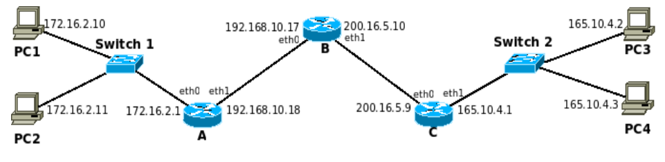

# Ej 21


## Inciso 1
Si una PC se desea conectar a otra PC en una red distinta, ¿es necesario ejecutar ARP? ¿A quién le envió el ARP Request?

Suposición: la PC origen no conoce la MAC destino, entonces yo creería que sí.

Verificación: Wireshark > eth0 en el router, luego hacemos ping de 10.0.0.20 a 10.0.1.22 por ejemplo. El tráfico desconocido desde la PC origen se manda al router (ya que ARP solo se transmite dentro de una misma red), por lo que primero solicita la MAC de éste. En resumen, <b>SI HAY ARP REQUEST, de origen a router</b>


* ¿Quién tiene 10.0.0.1 (router)? Contarle a 10.0.0.20 (origen)
* La puerta 10.0.0.1 del router le pasa su MAC al origen.
* Se realizan 3 echo/reply.
* ¿Quién tiene 10.0.0.20 (origen)? Contarle a 10.0.0.1 (router)
* La PC 10.0.0.20 le pasa su MAC al router.

## Inciso 2
Suponga que PC1_hub (10.0.0.20), que tiene la tabla ARP vacía, le quiere enviar un ping a PC2_hub (10.0.0.21). ¿Cuál es la secuencia de mensajes? Indique los mensajes ARP Request y Reply completando los campos de la trama Ethernet y de los mensaje ARP.

Análisis: están en la misma red (10.0.0.0), conexión directa por medio del hub.


ARP Request:
* MAC Destino (Ethernet): broadcast
* MAC Origen (Ethernet): MAC de PC1_hub
* Sender MAC (ARP): MAC de PC1_hub
* Sender IP (ARP): 10.0.0.20
* Target MAC (ARP): 0
* Target IP (ARP): 10.0.0.21

ARP Reply:
* MAC Destino: MAC de PC1_hub.
* MAC Origen: MAC de PC2_hub.
* Sender MAC: MAC de PC2_hub.
* Sender IP: 10.0.0.21
* Target MAC: MAC de PC1_hub.
* Target IP: 10.0.0.20

```
root@n4:/tmp/pycore.34107/n4.conf# ping -nR 10.0.0.21
PING 10.0.0.21 (10.0.0.21) 56(124) bytes of data.
64 bytes from 10.0.0.21: icmp_seq=1 ttl=64 time=0.063 ms
RR: 	10.0.0.20
	10.0.0.21
	10.0.0.21
	10.0.0.20
```

## Inciso 3
¿Cómo quedarían los mensajes ARP si el ping ahora es desde PC1_hub hacia PC2_SW? (Suponer que las tablas ARP están vacías)

ARP Request:
* MAC Destino (Ethernet): broadcast
* MAC Origen (Ethernet): MAC de PC1_hub
* Sender MAC (ARP): MAC de PC1_hub
* Sender IP (ARP): 10.0.0.20
* Target MAC (ARP): 0
* Target IP (ARP): 10.0.0.1 (router)

ARP Reply:
* MAC Destino: MAC de PC1_hub.
* MAC Origen: MAC del router.
* Sender MAC: MAC del router.
* Sender IP: 10.0.0.1
* Target MAC: MAC de PC1_hub.
* Target IP: 10.0.0.20

## Inciso 4
Para analizar los paquetes del protocolo ARP:

1. Ejecute el comando ifconfig -a en la PC1_hub.

```
eth0: flags=4163<UP,BROADCAST,RUNNING,MULTICAST>  mtu 1500
        inet 10.0.0.20  netmask 255.255.255.0  broadcast 0.0.0.0
        inet6 2001::20  prefixlen 64  scopeid 0x0<global>
        inet6 fe80::200:ff:feaa:2  prefixlen 64  scopeid 0x20<link>
        ether 00:00:00:aa:00:02  txqueuelen 1000  (Ethernet)
        RX packets 166  bytes 15664 (15.6 KB)
        RX errors 0  dropped 0  overruns 0  frame 0
        TX packets 18  bytes 1480 (1.4 KB)
        TX errors 0  dropped 0 overruns 0  carrier 0  collisions 0

lo: flags=73<UP,LOOPBACK,RUNNING>  mtu 65536
        inet 127.0.0.1  netmask 255.0.0.0
        inet6 ::1  prefixlen 128  scopeid 0x10<host>
        loop  txqueuelen 1000  (Bucle local)
        RX packets 0  bytes 0 (0.0 B)
        RX errors 0  dropped 0  overruns 0  frame 0
        TX packets 0  bytes 0 (0.0 B)
        TX errors 0  dropped 0 overruns 0  carrier 0  collisions 0
```

2. Luego ejecute el comando arp -n en la PC1_hub para ver su tabla ARP.

```
Dirección                TipoHW  DirecciónHW         Indic Máscara         Interfaz
10.0.0.1                 ether   00:00:00:aa:00:00   C                     eth0
```

3. Monitoree el tráfico ARP desde la PC3_hub ejecutando tcpdump -i eth0 -p arp

4. Envíe un ping desde la PC1_hub a PC2_hub y vuelva a observar la tabla ARP de PC1_hub.

```
18:13:51.012183 ARP, Request who-has 10.0.0.21 tell 10.0.0.20, length 28
18:13:51.012223 ARP, Reply 10.0.0.21 is-at 00:00:00:aa:00:03 (oui Ethernet), length 28
18:13:56.117288 ARP, Request who-has 10.0.0.20 tell 10.0.0.21, length 28
18:13:56.117351 ARP, Reply 10.0.0.20 is-at 00:00:00:aa:00:02 (oui Ethernet), length 28
```

```
Dirección                TipoHW  DirecciónHW         Indic Máscara         Interfaz
10.0.0.1                 ether   00:00:00:aa:00:00   C                     eth0
10.0.0.21                ether   00:00:00:aa:00:03   C                     eth0
```

6. Monitoree el tráfico ARP desde la PC3_SW ejecutando tcpdump -i eth0 -p arp.

7. Haga un ping a la PC2_SW y vuelva a observar la tabla ARP de la PC1_SW (PC1_hub?).

Si interpreto PC1_hub a PC2_SW, no hay tráfico detectado en PC3_SW y no hay cambios en la tabla ARP de PC1_hub.

8. Vea los resultados en la consola de PC3_HUB a fin de observar cuáles son las diferencias respecto a lo observado en el punto (V) en cuanto a cuáles son los paquetes que se ven en este caso.

```
18:23:21.364102 ARP, Request who-has 10.0.0.20 tell 10.0.0.1, length 28
18:23:21.364110 ARP, Request who-has 10.0.0.1 tell 10.0.0.20, length 28
18:23:21.364144 ARP, Reply 10.0.0.20 is-at 00:00:00:aa:00:02 (oui Ethernet), length 28
18:23:21.364147 ARP, Reply 10.0.0.1 is-at 00:00:00:aa:00:00 (oui Ethernet), length 28
```

## Inciso 5


1. Si PC1 envía un ARP Request para saber la dirección MAC de PC2, ¿qué dispositivos los recibirán? ¿Y a la respuesta de PC2?

Respuesta: solo lo recibe la red 172.16.2.0, es decir, el request PC2 y el reply PC1.

2. Agregue una entrada estática en la tabla ARP de PC1 para que pueda llegar a su router sin utilizar el protocolo. Usar el comando arp -s <IP> <MAC>

```
arp -s 172.16.2.1 A:eth0
```

3. Si PC3 le envía un ping a PC4, ¿cuál es toda la secuencia de mensajes suponiendo que las tablas ARP están vacías? ¿Cómo estarían compuestos estos mensajes?

* ARP Request (PC3 Sender, PC4 Target)
* ARP Reply (PC4 Sender, PC3 Target)
* Echo Request (PC3 > PC4)
* Echo Reply (PC4 > PC3)

4. Si PC1 le envía un ping a PC4, ¿cuál sería toda la secuencia de mensajes suponiendo que las tablas ARP contienen los datos de la consulta anterior? ¿Cómo estarían compuestos estos mensajes? ¿Cambian las direcciones IP
en los paquetes IP? ¿Y las direcciones MACs en las tramas Ethernet?

* Echo Request (PC1 > A > ?)