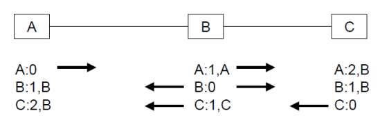

# Teoria 5 - Ruteo
Ruteo y Forwarding son cosas distintas.

- Ruteo refiere a construir la tabla de ruteo.
- Forwarding se refiere a usar la tabla de ruteo para encaminar paquetes.

El ruteo debe cumplir 3 propiedades:

- Consistente: todos los nodos deberán poseer conectividad, no pueden quedar loops, todo bien definido para Forwarding. Debe haber convergencia.

- Completo: cada nodo debe poseer información suficiente para hallar todos los caminos y así agilizar la convergencia.

- Escalable: el incremento de nodos, routers y subredes no debe provocar que se pierda conectividad. Ejemplo: inalcanzable por muchos saltos.

El ruteo puede ser estático (configuración manual) o dinámico (automático).

- Ventajas de estático: nos permite tener un mayor control de la red.

- Desventajas de estático: nos podemos equivocar en la tabla, es una tarea inhumana si la red es demasiado grande.

- Ventajas de dinámico: proceso automático, no habrá equivocaciones en la tabla, siempre obtiene algún camino "óptimo" (en base a métrica), es escalable.

- Desventajas de dinámico: requiere un mayor consumo de CPU, ancho de banda y memoria de routers.

## Parte A - Ruteo Interno
Por ahora conocemos 2 algoritmos:

- Distancia vectorial: consiste en que cada nodo (router) intercambie información únicamente con sus vecinos. 
    - En cada "turno", un router publica su tabla de ruteo a sus vecinos (red y cantidad de saltos + 1 a la misma).
    -  Cada vecino agregará o actualizará la tabla si...
        - La red destino no se encuentra en su tabla.
        - Recibió un camino a la red con una menor cantidad de saltos desde otro router origen (toma de camino óptimo).
        - Empeoró la cantidad de saltos a la red desde el mismo router origen, debido por ejemplo a un enlace caído.

    - Problema: cuenta a infinito. Si una red se vuelve inalcanzable para un router, la cantidad de saltos se toma infinito. Luego, como el router vecino le dirá que él conoce esa red con un Hop Limit finito + 1, adoptará ese valor y así sucesivamente... se adopta un valor finito, típicamente 16, para representar el infinito y así reducir el tiempo de convergencia.

    - Problema: si "infinito" es un número finito, entonces habrá redes inalcanzables debido a que la cantidad de saltos es grande, no porque el enlace está caído. Una solución es <b>Split Horizon</b>, en la cual los routers solo publican los caminos aprendidos por una interfaz distinta.

* Link-state: se comparten los enlaces para armar un grafo completo de la red, luego cada router aplica el algoritmo de Dijkstra para obtener un árbol de caminos óptimos.

## Parte B - Ruteo Externo
