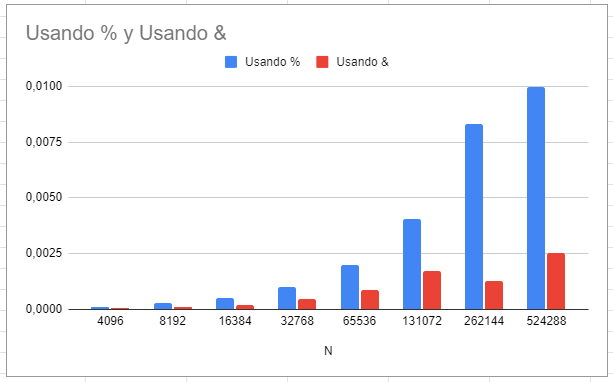

# Operación Resto en cada elemento del vector
En este caso se limita a usar un divisor potencia de 2. 

La primera versión usa el operador "%" que realiza una división para calcularlo. 

La segunda versión usa el operador "&" para aplicar una máscara de bits, que es mucho más rápido, como se observa a continuación.

