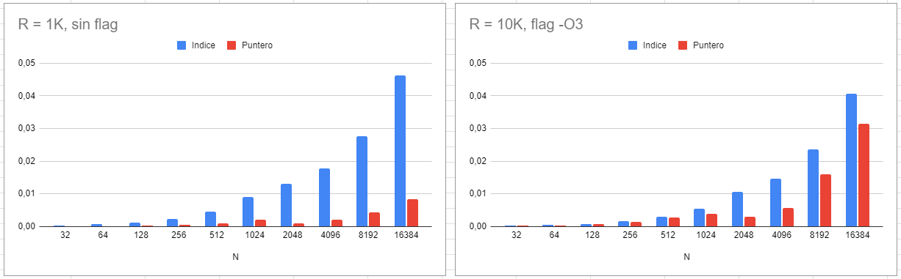

# Ejercicio 5

## Inicialización de Array
La primera versión utiliza un bucle for y va inicializando mediante un índice i.

La segunda versión crea un puntero inicialmente apuntando al inicio del vector, y luego lo va 
incrementando hasta su fin.

## Suma de Gauss
Sin utilizar flags de optimización (-O), hasta N=2.147.483.647 da resultados correctos y para el siguiente N ya da ERROR.

El problema se debe al rango de representación del tipo de dato utilizado. Los máximos son:

* i16: 2^15-1 = 32767
* u16: 2^16-1 = 65535
* i32: 2^31-1 = 2.147.483.647
* u32: 2^32-1 = 4.294.967.295

Claramente se debe a que el iterador i está usando el tipo de dato int, en este caso de 32 bits. Entonces cuando ejecuta i++ en el valor máximo pasa al mínimo (máximo negativo).
