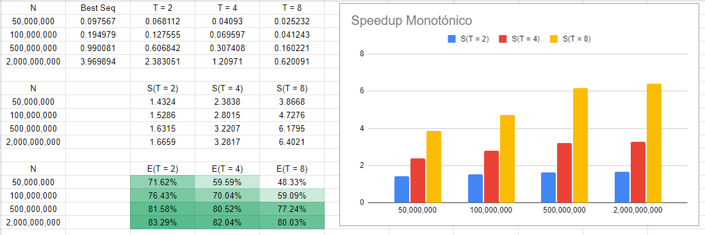

## Compilar
De la siguiente forma: ```gcc -DORDEN=i e6-seq.c -o e6-seq```, donde "i" es el orden que le queremos dar el vector (0: ninguno, 1: creciente, 2: decreciente).

En el caso de la versión paralela, agregar ```-pthread``` entre gcc y -DORDEN.

