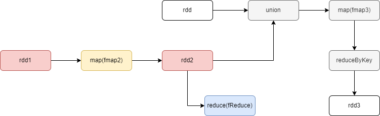
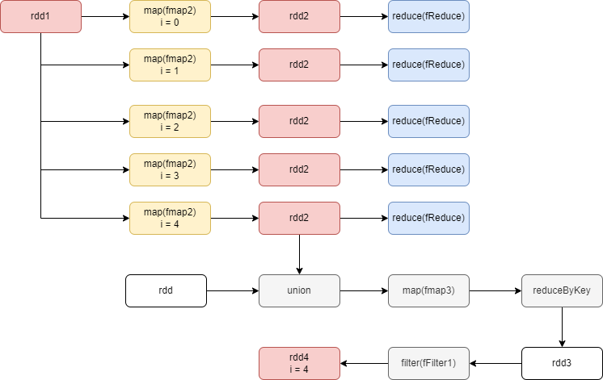
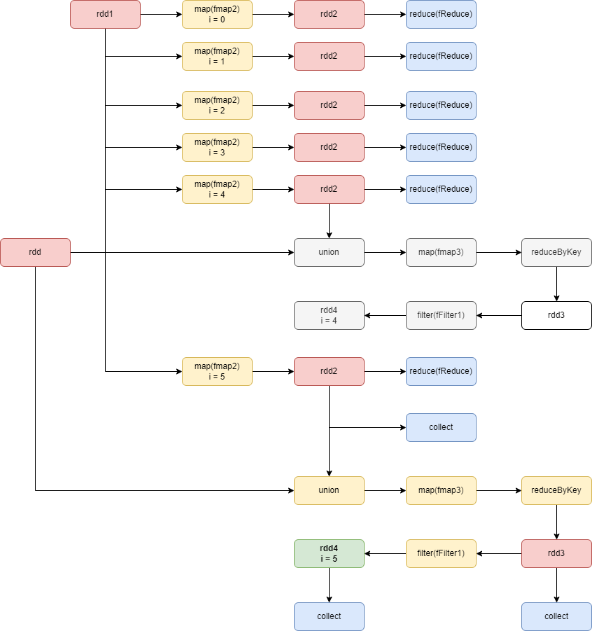

# DAG

Recordemos: parallelize es inmediato y no va al DAG.

    rdd1 = sc.parallelize(list)
    
    for i in range(6):
        rdd2 = rdd1.map(fmap2)          # T1
        r1 = rdd2.reduce(fReduce)
        rdd3 = rdd2.union(rdd).map(fmap3) \
            .reduceByKey(fReduceByKey)

        if(i > 3):
            rdd4 = rdd3.filter(fFilter1).persist()

    print(rdd4.collect())
    print(rdd2.collect())
    print(rdd3.collect())

Notemos que rdd1 no es sobreescrito, entonces las RRD de las iteraciones no van encadenadas.

## i = 0
Solo se ejecuta T1 para el reduce sobre rdd2:

## i = 4
Se sigue ejecutando T1 por cada iteración. El persist sobre rdd4 no tiene efecto hasta que se haya invocado una acción que lo atraviese

## i = 5 y final
- map(fmap2) es llamado 9 veces:
    - 5 entre i=0 e i=4 para reduce (distintos)
    - 1 para reduce en i=5
    - 1 para collect de rdd2
    - 1 para collect de rdd3
    - 1 para collect de rdd4 (persistido)

* union, map(fmap3) y reduceByKey: 2 veces c/u
    - 1 para collect de rdd3
    - 1 para collect de rdd4 (persistido)

- filter(fFilter1): 1 sola vez, collect de rdd4

En total fueron 9+2x3+1 = 16 transformaciones, cuando el minimo necesario es 10 (62.5 %)